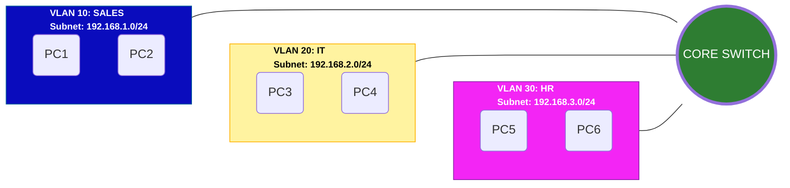

<br>

| [⬅️ Back to Table of Contents](../README.md) |
| :--- |


---

## Lab 01 - Basic VLAN Configuration

### Topology
- One Layer 2 Switch
- 6 PC
- 3 VLANs




### Goal 
- Understanding the VLAN concept
- Verify traffic isolation between different VLANs
- Observe communication behavior within the same VLAN

### VLAN Design 
- VLAN ID: 10, Name: SALES, Devices: PC1, PC2.
- VLAN ID: 20, Name: IT, Devices: PC3, PC4.
- VLAN ID: 30, Name: HR, Devices: PC5, PC6.

### Assign IP Adress for PCs
- VLAN 10: 192.168.1.0 /24
- VLAN 20: 192.168.2.0 /24
- VLAN 30: 192.168.3.0 /24

(No default gateway configured)

### Key Configuration
- Create VLAN: 10, 20, 30.
- Assign access ports to the correct VLAN
- Configure end devices with static IP addresses

### Example Configuration (CLI)
```bash
SWITCH>enable
SWITCH#configure terminal

SWITCH(config)#interface range f0/1 - 2
SWITCH(config-if-range)#switchport mode access
SWITCH(config-if-range)#switchport access vlan 10
SWITCH(config-if-range)#exit

SWITCH(config)#interface range f0/3 - 4
SWITCH(config-if-range)#switchport mode access
SWITCH(config-if-range)#switchport access vlan 20
SWITCH(config-if-range)#exit

SWITCH(config)#interface range f0/5 - 6
SWITCH(config-if-range)#switchport mode access
SWITCH(config-if-range)#switchport access vlan 30
SWITCH(config-if-range)#exit

SWITCH(config)#vlan 10
SWITCH(config-vlan)#name SALES
SWITCH(config-vlan)#exit

SWITCH(config)#vlan 20
SWITCH(config-vlan)#name IT
SWITCH(config-vlan)#exit

SWITCH(config)#VLAN 30
SWITCH(config-vlan)#name HR
SWITCH(config-vlan)#exit

```

### Verification 
- Verify VLAN assignment:
  - *show vlan brief*
- Ping test results:
  - Same VLAN communication: **Success**
  - Different VLAN communication: **Fail**
 
### Result 
- Devices within the same VLAN can communicate
- Devices in different VLANs can not communicate without Layer 3 routing (Inter-VLAN Routing)

### Troubleshooting / Common Mistakes
- Ports assigned to the wrong VLAN
- Verify using *```show vlan brief```*

- Mac address table may apear emty if no traffic has been generated.
- Verify using *```show mac-address-table```*. Generate traffic by using *```ping IP address```* in PC's Command Prompt within the same VLAN.
  - (eg. Ping 192.168.1.2 from PC1 to PC2 in VLAN 10)

- VLAN not created before assigning ports
- Ports remain in default VLAN 1

- Expecting inter-VLAN communication
- Inter-VLAN Routing is not configured in this lab

### Notes 
> [!NOTE] 
> - Each VLAN respresents a seperate broadcast domain.
> - Inter-VLAN communication requires a Layer 3 device such as router or Layer 3 switch.

---
 [🏠 Main Menu](../README.md) | [Next Lab ➡️](../02A-VLAN-TRUNK-DEFAULT-(PKT-%2B-CML)) |
| :---: | ---: |
